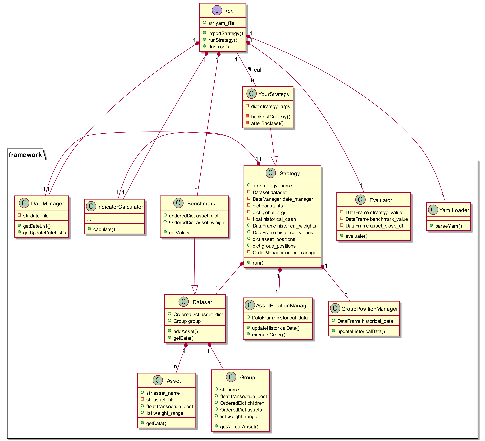

# 轻量级策略回测框架
*苑思成，20220428*  
*https://github.com/yuansicheng/quantitative_strategy_framework/tree/master*

## 一、框架设计背景
上一个版本 *https://github.com/yuansicheng/strategy_template/tree/master* ，实现了回测的基本功能，但是使用和配置比较复杂，因此在上一个版本的基础上，主要针对以下方面进行了升级和优化： 
### 1. 配置方面：
- 使用yaml作为配置文件，yaml相对于python的好处在于语法简单，用户使用已有yaml模板可以快速更改参数进行下一组回测；
- 使用动态加载策略代码的方式，用户使用不同策略时，入口都是同一个python脚本；
- 使用matrix（参考github action）的方式，用户可以通过指定不同的参数实现多组参数的回测；
  
### 2. 策略方面：
- 将净值计算方式变更为订单驱动，即任意交易按照策略计算出的权重，将被转换为一系列订单进行计算。因此需要在原基础上增加订单管理和仓位管理模块；
- 将用户数据与原始数据隔离，避免用户在编写回测策略时误用未来的数据导致结果出错；
- 策略执行结束后保存策略历史净值、历史权重、历史现金仓位、资产仓位、资产分组仓位等数据；
- 整合指标计算模块，使用户在使用过程中无需自己编写常用指标计算函数；
  
### 3. 效率方面：
- 为每组参数对应的策略创建一个线程，并行执行回测和保存数据，提高回测效率；
- 设置守护线程，当策略全部执行完毕后统一进行评估，减少重复的计算量。

## 二、框架结构
 

## 三、用户手册

### 1. 编写策略
在./strategy文件夹下新建一个文件夹，建议使用策略的小写名称命名；
- 在该文件夹下新建.py文件，编写策略继承Strategy基类；
- 导入策略基类;
    ```python
    from framework.strategy import Strategy
    ```
- 继承策略基类；
    ```python
    class YourStrategy(Strategy):
        def __init__(self, *args, strategy_args={}, **kwargs) -> None:
            super().__init__(*args, **kwargs)
            self.strategy_args = strategy_args
    ```
- 实现backtestOneDay函数，该函数用于交易日循环，在该函数中，推荐用户通过对当前日期进行判断，执行对应的操作，将具体操作写到另外的函数中，比如计算单期策略或再平衡。用户可以使用的变量如下：
  - self.current_date：当前日期；
  - self.update_date：按照用户设置的频率计算出的所有需要执行策略的日期；
  - self.rebalance_date：按照用户设置的频率计算出的所有需要执行再平衡的日期；
  - self.user_close：当前日期前buffer天（buffer需在yaml中配置）各资产的收盘价，未归一化；
  - self.user_yield：当前日期前buffer天各资产的收益率，未-1，即当天收盘价/前一天收盘价；
  - self.user_raw_data：一个字典，key为资产名称，value为当前日期前buffer天各资产的原始数据；
  - self.asset_positions：一个字典，key为资产名称，value为当前资产的仓位管理器，可获取当前资产的仓位等信息，字段及含义见用户手册；
  - self.group_positions：一个字典，key为资产名称，value为当前分组的仓位管理器字段及含义同上；
  - self.indicator_calculator：指标计算器，封装常用指标，用户也可以自己编写指标计算函数，使用caculator函数运行。IndicatorCalculator内置函数参考代码framework/indicator_calculator.py；
- 策略运行结果，框架支持目标权重和订单两种输入；
  - 目标权重：框架为用户初始化一个self.weights变量，默认为None，用户可以将该变量设置为当天的目标权重，格式为dict或DataFrame；框架将自动将目标权重转换为订单；
  - 订单：框架为用户初始化一个self.orders变量，默认为[]，用户可用向该变量中添加当天的订单，订单执行后将被放入订单管理系统，执行订单操作由框架完成。添加订单的方式如下：
    ```python
    self.orders.append(Order(date=_, asset=_, money=_, mark=_))
    # mark默认为空，其余3项必须设置
    ```
- 实现afterBacktest函数，该函数在回测（所有日期）结束后执行一次，用户可以在该函数中保存一些策略中间结果，策略、仓位等通用结果将会统一保存，用户无需再次保存。保存的文件名可以按照下面代码设置：
    ```python
    os.path.join(self.result_path, your_file_name)
    ```   

### 2. 编写配置文件
新建一个yaml配置文件，后缀为.yaml或.yml，配置文件中需要包含5部分；
- constants：配置常用常数。比如DAY_OF_YEAR、RFR等，配置文件中需要引用常数时，可使用&和*的yaml语法；
- global_args：策略通用的参数，这些参数需要在策略基类中使用，因此必须设置；
  - loglevel：输出日志级别（10-DEBUG, 20-INFO, 30-WARNING, 40-ERROR, 50-CRITICAL），常用20；
  - result_path：策略结果文件保存地址，由于该框架支持多策略并行，每个策略将会在该文件夹下新建一个以策略名命名的文件夹；
  - transection_date_file：交易日列表，一个csv文件，可用choice导出，但是只能导出到当年年底，需要跨年后更新或使用choice的Excel插件生成，公式为
    ```vb
    EM_TRADEDATES("1990-01-01","2029-12-31","Period=1,Order=1,MarketType=CNSESH,Format=1,Layout=1,ClearNumber=0")
    ```
  - backtest_date_range：回测区间，由一个list确定，list中的两个元素分别代表开始和结束，格式为[年，月，日]，例如[[2010, 1, 1], [2010, 12, 31]]
  - frequency：策略更新频率，整数或weekly，monthly，quarterly；
  - rebalance_frequency：策略再平衡频率，同上；
  - buffer：读取原始数据时的缓冲区，向前多读一些数据；
  - cash：初始资金，默认为10000；
  - fig_type：画净值图的方法，可选png或html。png：使用matplotlib画图，保存一个png图片；html：使用pyecharts画动态图，需要安装pyecharts，生成一个html文件，使用浏览器可打开及动态查看图片。推荐使用html。

- strategy：指定使用的策略，
  - strategy_file：策略文件的路径，用.分隔，策略文件对于run.py的相对路径，比如strategy.rp.rp_strategy；
  - strategy_name：策略子类的名称；
  程序将动态加载该策略，即在代码中生成：
    ``` python
    from strategy_file import strategy_name
    ```

- strategy_args：将要传给策略子类的参数，使用matrix的方式解析并生成多个策略，可用于参数搜索。
    ``` yaml
    strategy_args: 
        # 固定参数可以直接设置
        key_1: value_1
        # 变量参数使用list设置
        key_2: [value_2_1, value_2_2]
        key_3: [value_3_1, value_3_2]
    ```
    按照上述配置，框架将会生成4组策略，启动4个线程进行回测。

- dataset：用于回测的数据集，支持任意层的资产分组，同一个分组下可以设置子分组和资产。
  - 结构：所有资产必须属于root组，即
    ``` yaml
    dataset:
      group:
        - group_name: root
    ```
    root组下设置子分组和资产，
    ``` yaml
    dataset:
      group:
        - group_name: root
            group:
              - group_name: bonds
            asset:
              - asset_file: data/中债-国债总财富(总值)指数.csv
    ```

  - 分组和资产默认值可按照如下设置
    ``` yaml
    group_default: &group_default
      group_name: ''
      transection_cost: 0.0002
      weight_range: [0., 1.]

    asset_default: &asset_default
      asset_name: ''
      asset_file: ''
      type: precision
      transection_cost: 0.0002
      weight_range: [0., 1.]
    ```
    通过`<<: *group_default`和`<<: *asset_default`导入默认配置。
  - 资产模糊指定：用户可通过通配符指定一系列资产，需要将type关键字设置为fuzzy，框架将会调用glob模块解析并寻找所有符合条件的资产，以黄金为例，
    ``` yaml
    - asset_file: data/*黄金*
      type: fuzzy
      <<: *asset_default
    ```
    即可实现模糊指定。

- benchmark：业绩基准，可使用list的方式设置多个，用户需指定基准名称、资产文件和权重，各资产权重之和须等于1，例如，
    ``` yaml
    - name: 0.8x国债+0.2x沪深300
      asset:
        - asset_file: data/中债-国债总财富(总值)指数.csv
          weight: 0.8
        - asset_file: data/沪深300指数(全收益).csv
          weight: 0.2
    ```

### 3. 检查运行结果
用户可通过运行`python run.py --yaml_file _`运行策略，所有策略都可以通过这种方式执行。策略结束后，将自动保存如下数据：
- 策略净值汇总图：all_in_one.png/html
- 策略评估汇总：evaluation.xlsx，其中指标如下：
  - 每年的收益率（不足一年的由这部分数据计算年化收益）；
  - 累计收益率=$100 \times (回测期内最后一个净值/第一个净值-1)$；
  - 年化收益率=$100 \times ((回测期内最后一个净值/回测期内第一个净值)^{DAYOFYEAR/回测天数}-1)$；
  - 年化波动率=$100 \times std(日收益) \times \sqrt{DAYOFYEAR}$；
  - 最大回撤；
  - 最大回撤发生区间；
  - 最长回撤持续时间；
  - 最长回撤发生区间；
  - sharp比率=$(年化收益率-RFR)/年化波动率$；
  - calmar比率=$(年化收益率-RFR)/最大回撤$；
  - sortino比率=$(年化收益率-RFR)/下行波动率$；
  - 信息比率=$(年化收益率-业绩基准年化收益率)/跟踪误差$ （DataFrame中存储策略相对于各个资产的信息比率）。

对于每组参数，将保存：
- historical_data.xlsx：包含以下sheet：
  - values：
    - value：资产净值+现金；
    - shares：总份额；
    - nav：策略净值；
    - total_asset_position：资产净值总和；
    - cash：现金；
    - cash_weight：现金占比；
  - orders：历史订单；
  - asset_weights：每日各资产的权重；
  - group_weights：每日各资产分组的权重；
- asset_positions.xlsx：资产历史仓位，每个资产占用一个sheet；group_positions.xlsx：资产分组历史仓位，每个分组占用一个sheet，由组内资产仓位计算得到；字段及含义如下，
  - weight：权重；
  - position：仓位，持有该资产的总价值；
  - close：收盘价；
  - daily_return：当日收益率；
  - total_investment：总投资，不考虑做空；
  - cost_price: 单位资产的成本；
  - total_yield：资产持有收益率；
  - total_return：资产总收益；
  - number_of_position：持有数量；
  - total_transection_cost：累计交易成本；
- group_positions：资产分组历史仓位，字段同上；
